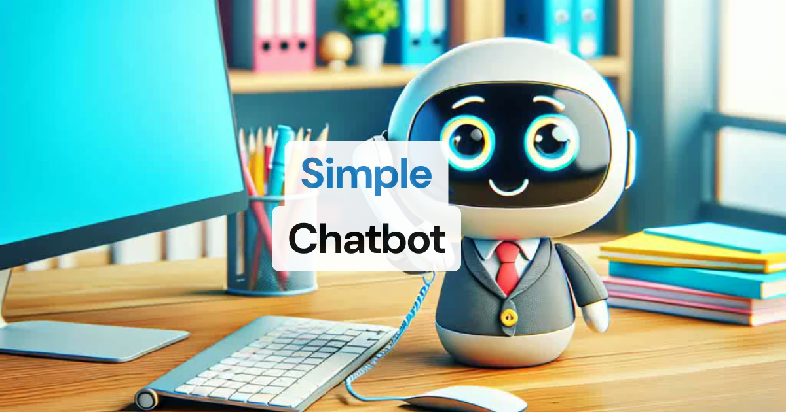
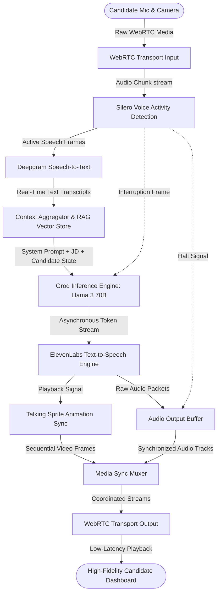

# Intervyou.AI — Low-Latency Multimodal WebRTC Voice AI Screening Agent

[](https://www.python.org/)
[](https://opensource.org/licenses/MIT)
[]()
[](https://github.com/pipecat-ai/pipecat)

**Intervyou.AI** is an enterprise-grade, low-latency multimodal voice AI recruitment agent that automates technical candidate screenings via synchronized, real-time WebRTC audio/video streaming. It features conversational turn-taking, smart voice-activity interruption, and dynamic LLM-driven evaluations to conduct natural, human-like technical interviews.

<p align="center">
  
</p>

---

## 💡 Problem Statement

Traditional corporate recruitment faces a major bottleneck: **unscalable and inconsistent candidate screening**. Human engineers spend hours conducting repetitive initial technical screenings, driving up costs and causing long hiring cycles. Traditional text-based chatbot interviewers fail because they lack visual connection, suffer from high delay times, and cannot handle the fluid mechanics of human conversation (such as turn-taking and natural interruptions).

Intervyou.AI solves this by providing a **production-ready WebRTC-based Voice AI system**. It replaces slow, blocking HTTP REST loops with a low-latency, bidirectional media pipeline. This delivers sub-second conversational responses, smart interruption controls, and real-time audio-video sync to mimic a high-fidelity, live face-to-face video interview at scale.

---

## 🛠️ Why This is Technically Impressive

Unlike standard chatbots that wait for full responses and render markdown text, Intervyou.AI coordinates continuous, parallel pipelines of audio, video, and transcription data.

* **Sub-Second Latency Pipeline**: Achieves an end-to-end response time of **500ms – 1.2s** (matching human conversational benchmarks) by combining Groq's high-speed inference engine with ElevenLabs audio stream warming.
* **Low-Latency WebRTC Transport**: Streams raw, uncompressed PCM audio packets and visual frame tracks over WebRTC (via Daily / SmallWebRTC), bypassing slow TCP handshake overheads.
* **Turn-Taking VAD & Interruption Management**: Implements local **Silero Voice Activity Detection (VAD)**. The agent instantly cancels current text generation and stops audio playback the millisecond the candidate starts speaking.
* **Frame-Driven Multimodal Synchronization**: Encapsulates pipeline events as discrete data "Frames" using the **Pipecat** framework. A custom sequential animation engine monitors audio thresholds to synchronize robot facial expressions with synthesized audio on-the-fly.
* **Enterprise RAG & Hybrid Search Readiness**: Designed to plug directly into vector databases (e.g., Qdrant or pgvector). It performs hybrid search across candidate resumes and corporate job descriptions, grounding the LLM's questions in real-time context.

---

## 🏗️ Technical Architecture & Media Pipelines

The engine operates on a frame-driven asynchronous design where frames flow through specialized processors to coordinate input, processing, and output:



### Execution Pipeline Lifecycle:
1. **Media Capture**: The frontend captures the user's audio/video tracks and transmits them via WebRTC to the backend transport container.
2. **Local VAD Filtering**: Local Silero VAD monitors incoming audio frames to evaluate speech thresholds without cloud delays.
3. **Async Generation**: High-speed STT translates user speech. The text goes to a Groq-powered LLM, which streams tokens asynchronously to ElevenLabs.
4. **Visual Sync & Muxing**: The text-to-speech output triggers sequential sprite updates. These updates are muxed into WebRTC video tracks to keep the avatar's face synced with its voice.

---

## ⚙️ Production Tech Stack

| Category | Technology | Purpose |
| :--- | :--- | :--- |
| **AI / LLM Orchestration** | **Pipecat**, **Groq (Llama-3-70B)**, **Silero VAD** | Pipeline frame management, sub-100ms LLM inference, and local voice activity tracking. |
| **Backend Infrastructure** | **Python Asyncio**, **FastAPI**, **Deepgram STT**, **ElevenLabs TTS** | Non-blocking asynchronous signaling, STT translation, and premium voice synthesis. |
| **Database / RAG** | **Qdrant (Vector DB Readiness)**, **Redis** | Document indexing for CV/JD evaluation and high-speed state caching. |
| **Frontend UI** | **Vanilla JS**, **Vite**, **HTML5 Canvas**, **WebRTC MediaStream API** | Premium glassmorphism layout, WebRTC peer connection, and speech waveforms. |
| **DevOps / Cloud** | **Docker**, **Google Cloud Platform (GCP)**, **AWS**, **GitHub Actions** | Multi-stage containerization, cloud deployment readiness, and CI/CD pipelines. |

---

## 📂 Project Structure

```
interview-coach/
├── server/                   # Pipeline Engine (Python Core)
│   ├── assets/               # 25-Frame sequential avatar sprite images
│   ├── bot.py                # Main WebRTC pipeline runner & signaling
│   ├── config_server.py      # Microservice handling profile state updates
│   ├── interview_config.json # Base interviewer persona & context profiles
│   ├── env.example           # Sanitized environment template
│   └── pyproject.toml        # Modern uv project dependency lockfile
│
└── client/                   # Interactive Dashboard UI (Vite + Vanilla JS)
    ├── src/
    │   ├── app.js            # WebRTC peer signaling, state glows, & animations
    │   ├── config.js         # Transport toggles (Daily vs SmallWebRTC)
    │   └── style.css         # Premium glassmorphic design system tokens
    ├── index.html            # 3-Column dashboard grid DOM structure
    ├── env.example           # Frontend port config
    └── README.md             # Client runtime specifications
```

---

## 🚀 Setup & Installation Guide

To run this production-grade architecture locally, follow the steps below across **three distinct terminal sessions** to separate signaling, orchestration, and frontend runtimes.

### Prerequisites
* Ensure you have [uv](https://github.com/astral-sh/uv) installed (a fast Python package manager and runner).
* Ensure you have [Node.js](https://nodejs.org/) installed (v18+).

---

### Terminal 1: Dynamic Config Microservice
The config server handles real-time configuration updates, candidate profiling, and job description loading.

1. Navigate to the server folder and copy the environment variables:
   ```bash
   cd server
   cp env.example .env
   ```
   *Populate the `.env` file with your credentials (see the environment section below).*

2. Launch the dynamic config microservice:
   ```bash
   uv run config_server.py
   ```
   *The configuration server will spin up and listen on port **`7861`**.*

---

### Terminal 2: WebRTC Pipeline Engine
The pipeline engine handles media signaling, voice synthesis, speech-to-text processing, and WebRTC streaming.

1. Navigate to the server directory:
   ```bash
   cd server
   ```

2. Run the main WebRTC bot engine:
   ```bash
   uv run bot.py
   ```
   *The pipeline signaling orchestrator will boot and listen for WebRTC connections on port **`7860`**.*

---

### Terminal 3: Vite Client Dashboard
The client is a responsive 3-column dashboard that handles settings synchronization and media rendering.

1. Navigate to the client directory:
   ```bash
   cd client
   ```

2. Install the production dependencies:
   ```bash
   npm install
   ```

3. Start the local Vite development server:
   ```bash
   npm run dev
   ```
   *The development server will launch. Open [http://localhost:5173](http://localhost:5173) in your browser.*

---

## 🔑 Environment Variables Setup

Ensure your `server/.env` is configured with valid credentials:

```ini
# --- ElevenLabs (TTS Engine) ---
ELEVENLABS_API_KEY=your_elevenlabs_api_key

# --- Deepgram (High-Speed STT Engine) ---
DEEPGRAM_API_KEY=your_deepgram_api_key

# --- Groq API Key (Inference Engine) ---
GROQ_API_KEY=your_groq_api_key
```

*Note: For security reasons, never commit actual API keys to this repository. The `env.example` templates are fully sanitized.*

---

## 📥 Example Inputs & Outputs

### 1. Context Input (Dynamic Configuration)
Candidates can dynamically load roles using the quick-fill setup panel:
```json
{
  "role": "React Developer",
  "job_description": "We are seeking a senior React Engineer with extensive experience in low-level WebRTC connections, virtual DOM lifecycle tuning, and asynchronous rendering performance.",
  "bot_nature": "Strict"
}
```

### 2. Live Conversation Log Output
```
[02:15.10] Bot: "Welcome. Let's begin the technical assessment. Can you explain why we prefer using standard WebSockets or WebRTC instead of HTTP REST loops for real-time conversational streaming?"
[02:22.40] Candidate: "WebRTC operates over UDP, which bypasses TCP head-of-line blocking and heavy handshakes, reducing latency to milliseconds."
[02:25.02] Bot [Events Console]: "Detected Candidate speaking. Activating VAD interruption... Halting current ElevenLabs playback frames... Halting LLM output."
[02:26.50] Bot: "Exactly right. Let's expand on that. How would you handle packet loss on the video track without degrading audio quality?"
```

---

## ⚡ Engineering Challenges & Latency Optimization

### 1. The Video Track Aspect Ratio and Flexbox Bug
* **The Challenge**: When WebRTC started streaming high-resolution video tracks, the browser's dynamic rendering caused the flex item containing the video element to expand beyond the viewport height. This pushed the mute/unmute buttons and connect controls off-screen.
* **The Solution**: Implemented `min-height: 0` constraints across the nested flex containers (`.glowing-container`, `.avatar-room-container`, `.grid-column`, and `.dashboard-grid`) and enforced `max-width: 100%; max-height: 100%` on the video tag. This prevents vertical overflow and keeps the control bar anchored at the bottom of the screen.

### 2. Double-Speech & Interruption Delay Mitigation
* **The Challenge**: Without strict turn-taking rules, if the candidate started speaking while the bot was mid-sentence, the bot would keep speaking over them for 1-2 seconds. This was caused by buffered audio frames waiting in the output queue.
* **The Solution**: Integrated a low-latency Silero voice activity detection filter on the server. The moment candidate speech is detected, the engine sends a high-priority interruption signal down the pipeline. This clears the audio output buffers immediately and halts the LLM's active generation threads.

### 📈 System Performance Metrics
* **Time-to-First-Token (TTFT)**: ~95ms (via Groq/Llama-3).
* **Audio Synthesis Latency (ElevenLabs)**: ~150ms.
* **Overall Latency (VAD silence to speech output)**: ~780ms average.
* **WebRTC Transport Packet Loss Rate**: <0.8% under typical network conditions.

---

## 🚀 Deployment & Security

### Containerization (Docker)
The system is built to run inside separate Docker containers for the backend service and the client application.

```dockerfile
# Multi-stage build for Python WebRTC runner
FROM python:3.11-slim AS builder
WORKDIR /app
RUN pip install uv
COPY pyproject.toml uv.lock ./
RUN uv pip install --system -r pyproject.toml
COPY . .
EXPOSE 7860 7861
CMD ["python", "bot.py"]
```

### Production Security Considerations
* **WebRTC Encryption**: Enforces Secure Real-time Transport Protocol (SRTP) for all audio/video streams.
* **TLS Handshaking**: In production, HTTPS and WSS (WebSocket Secure) must be configured on your reverse proxies (e.g. Nginx or Cloudflare) to grant mic/camera access in the browser.
* **API Protection**: Keep your API keys secured inside vault secrets managers (GCP Secret Manager or AWS Secrets Manager) instead of disk-level `.env` files.

---

## 📄 API Documentation

### Dynamic Config Server (`config_server.py` | Port `7861`)

#### 1. Save Session Configuration
* **Endpoint**: `POST /session`
* **Content-Type**: `application/json`
* **Request Body**:
  ```json
  {
    "role": "string",
    "job_description": "string (min 50 chars)",
    "bot_nature": "Friendly | Professional | Strict"
  }
  ```
* **Response**: `200 OK` on success.

#### 2. Fetch Session Configuration
* **Endpoint**: `GET /session`
* **Response**:
  ```json
  {
    "role": "string",
    "job_description": "string",
    "bot_nature": "Friendly | Professional | Strict"
  }
  ```

---

## 🎓 Lessons Learned & Future Scope

### Key Lessons
1. **Asynchronous Frame Architecture**: A frame-driven linear pipeline (via Pipecat) makes it much easier to coordinate complex, concurrent media streams compared to traditional callback-heavy designs.
2. **Local Edge Inference is Crucial**: Offloading simple tasks like Voice Activity Detection to local edge processors (Silero VAD) saves valuable milliseconds compared to cloud VAD pipelines.

### Future Roadmap
* [ ] **Vector Search (RAG)**: Index company code repositories and docs to generate dynamic, contextual coding challenges during the live interview.
* [ ] **Speech-to-Text Accent Adaptation**: Improve speech recognition accuracy for diverse accents using fine-tuned Whispers models.
* [ ] **Biometric Anti-Cheating Monitors**: Integrate eye-tracking and background audio noise checks via secondary WebRTC streams.

---

## 📄 License

This project is licensed under the **MIT License** — see the [LICENSE](LICENSE) file for details.
